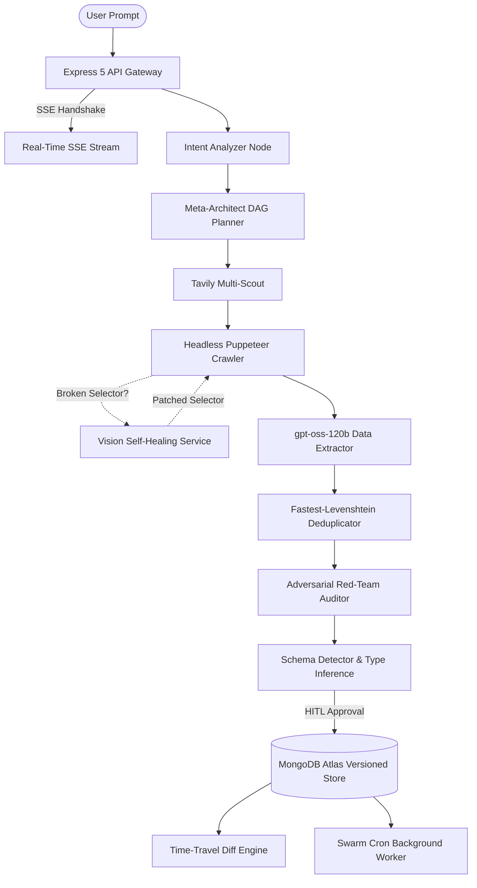

# ⚡ Cerkit AI — Autonomous Agentic Data Engineering & Swarm Intelligence Platform

[](https://nodejs.org)
[](https://expressjs.com)
[](https://langchain.com)
[](https://langchain-ai.github.io/langgraphjs/)
[](https://groq.com)
[](https://mongodb.com)
[](https://pptr.dev)

> **Cerkit AI** is an enterprise-grade multi-agent autonomous data engineering platform that transforms unstructured natural language instructions into verifiable, structured, real-time datasets with zero-hallucination guarantees and automatic visual self-healing.

---

## 📚 Complete Technical Documentation

For complete, hackathon-grade technical breakdowns, model matrices, API references, and architecture flows, refer to:

* 📖 **[PROJECT_ARCHITECTURE.md](./PROJECT_ARCHITECTURE.md)** *(or [docs/PROJECT_ARCHITECTURE.md](./docs/PROJECT_ARCHITECTURE.md))*  
  **The Master Documentation (Single Source of Truth)**: Contains all 44 architectural sections, AI Model Matrix, Tool Registry, API Reference, Security Analysis, Performance Benchmarks, and 1-Minute Judge Pitch.
* ⚙️ **[SYSTEM_ARCHITECTURE.md](./SYSTEM_ARCHITECTURE.md)** *(or [docs/SYSTEM_ARCHITECTURE.md](./docs/SYSTEM_ARCHITECTURE.md))*  
  **LangGraph State Machine & Dynamic Compiler Reference**: Low-level runtime execution engine and DAG planner specification.

---

## 🚀 Key Architectural Breakthroughs

1. **👁️ Vision-Guided Self-Healing Scrapers**:
   Websites break traditional scrapers with frequent redesigns and randomized CSS classes. Cerkit AI catches broken selectors, visually inspects rendered viewports, determines semantic element coordinates, and automatically synthesizes patched CSS selectors in real time.
2. **⚔️ Adversarial Red-Team Auditor**:
   Standard extraction pipelines blindly accept false information. Cerkit AI deploys an adversarial courtroom: an *Advocate Agent* proposes data rows, while an independent *Red-Team Skeptic* cross-examines claims against external authority sources, flagging contradictions with `🟢 VERIFIED` or `🟡 CONTESTED` badges and dual citations.
3. **⏳ Time-Travel Data Diffs ("Git for Web Data")**:
   Tracks dataset mutations across historical runs using Levenshtein distance entity matching and currency normalization, categorizing changes into `Added`, `Removed`, `Mutated`, and `Unchanged`.
4. **🤖 Autonomous Swarm Cron Scheduler**:
   An autonomous background scheduler running periodic crawls based on user configuration (`daily`, `weekly`, `monthly`) and dispatching executive change digests via outbound webhooks (Slack, Discord, Custom).
5. **🔄 Dynamic Groq API Key Rotation**:
   A custom monkey-patched gateway intercepting LangChain's Groq invocations to cycle keys across an environment pool in round-robin fashion, eliminating HTTP 429 rate-limiting stalls.

---

## 🏗️ System Architecture Flow



---

## 🛠️ Tech Stack & AI Models

* **Runtime & Gateway**: Node.js (ESM), Express 5.2.1, Winston, Morgan, Zod 4.4.3
* **Agentic Orchestration**: LangChain 1.4.5, LangGraph 1.4.4
* **AI Models (Groq Cloud LPU)**:
  * `openai/gpt-oss-120b`: Structured extraction, schema reasoning, dossier synthesis
  * `qwen/qwen3.8-27b`: Intent analysis, adversarial auditing, CSS selector synthesis
  * `gemini-2.5-flash`: Fallback multimodal visual element grounding
* **Web Scraping & Tools**: Puppeteer 25.10.0, Cheerio, Turndown, Tavily API, Math.js
* **Persistence**: MongoDB Atlas (Mongoose 9.7.1) with compound text search and lineage versioning

---

## ⚡ Quick Start

### 1. Prerequisites
* Node.js v20+
* MongoDB Instance (Local or MongoDB Atlas)
* Groq Cloud API Key (`GROQ_API_KEY`)
* Tavily Search API Key (`TAVILY_API_KEY`)

### 2. Environment Setup
Create a `.env` file in the root directory:
```env
PORT=5000
NODE_ENV=development
MONGO_URI=mongodb+srv://<username>:<password>@cluster.mongodb.net/cerkit?retryWrites=true&w=majority
CLIENT_URL=http://localhost:5173

# AI Inference Keys (Supports round-robin rotation)
GROQ_API_KEY=gsk_YOUR_PRIMARY_KEY
GROQ_API_KEY_2=gsk_YOUR_BACKUP_KEY_2
GROQ_API_KEY_3=gsk_YOUR_BACKUP_KEY_3

# Search & Multimodal
TAVILY_API_KEY=tvly-YOUR_TAVILY_KEY
GOOGLE_API_KEY=AIzaSyYOUR_GOOGLE_KEY
```

### 3. Installation & Run
```bash
# Install dependencies
npm install

# Start development server with hot-reload
npm run dev

# Start production server
npm start
```

---

## 🧪 Automated Testing

```bash
# Run all registered tools tests (16 tools)
node tests/test-tools.js

# Test Vision Self-Healing scraper recovery
node tests/test-self-healing.js

# Test Adversarial Red-Team fact-checker
node tests/test-auditor.js

# Test Time-Travel Diff Engine
node tests/test-diff-engine.js
```

---

## 📄 License
ISC License — Cerkit AI Swarm Engine.
